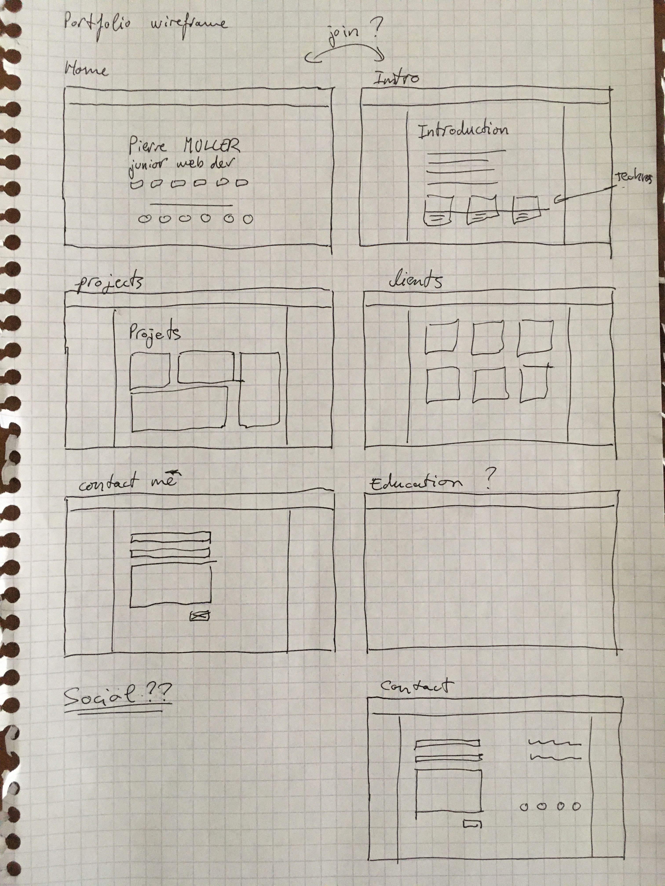
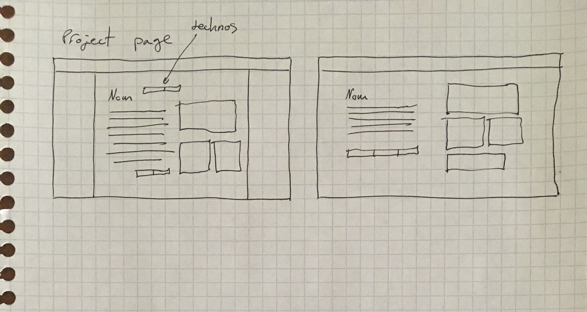
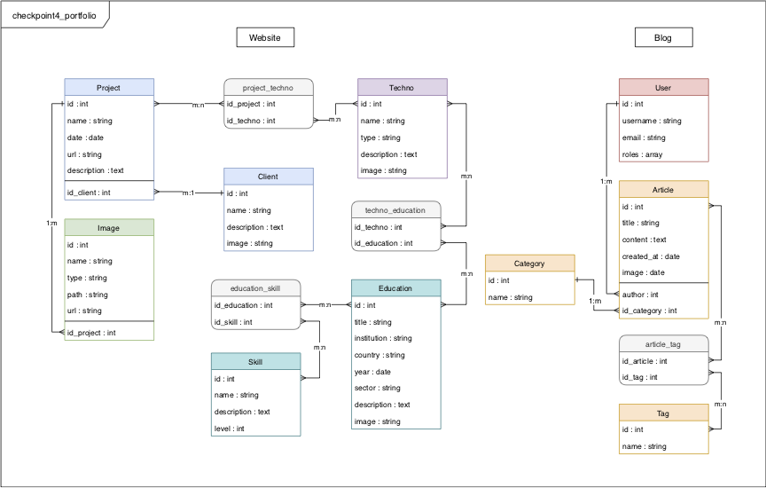

# Online portfolio - Pierre MULLER
###### Checkpoint #4 - Wild Code School

## Kick off
As a futur talented and sought-after Web Developer, you all have to pass a lot of technical interview, so maybe a personal portfolio website could be useful for your life after wild code school.

- As it's your personal website, feel free to use the design you want and template it as you wish. You can find below some examples of feature•

- An administration dashboard to add/edit entry in your portfolio

- Each project in your portfolio car contains a gallery, a link to the application, a description, a date...

- Manage a list of technologies/languages linked to each project

- A list of your clients

Awesome ideas from your imagination, you are your own product owner!

## Project
### Features :
- Home frontpage with basic informations
- Login system
- Admin panel
- Secured admin access
- Admin can add/edit the website's content

### Tech used :
- PHP 7.4
- Symfony 5.1
- MySQL
- Doctrine ORM
- Yarn
- Bulma
- SCSS
- Webpack Encore

### Tools used :
- PhpStorm
- Git / GitHub
- Trello
- Draw.io (UML)

#### Symfony extra bundles :
- Security
- Fixtures

## Setup
1. `$ git clone https://github.com/kiw808/checkpoint4_portfolio.git`
2. Create `.env.local` file from `.env and configure your database
3. `$ cd <project_directory>`
4. `$ composer install`
5. `$ bin/console doctrine:database:create`
6. `$ bin/console doctrine:migrations:migrate`
7. `$ bin/console doctrine:fixtures:load`
8. `$ yarn install`
9. `$ yarn encore dev`
10. `$ symfony serve`
11. Your'e good to go, just head to `localhost:8000` !

Dashboard login :
- username : admin
- password : admin

***

### Product backlog :
- [Trello](https://trello.com/invite/b/g14ISXDM/f47abc0714a4bed55ca4d783bba43154/portfolio)

### Wireframe :

### Database conceptual model :

### Product owner :
Pierre Muller